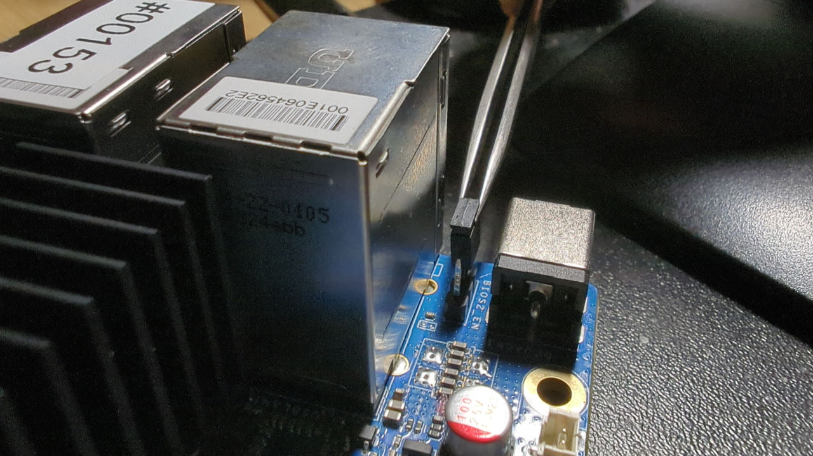

# Recovery

## Intro

The following documentation describes the process of recovering hardware from
the brick state using an [RTE](../../transparent-validation/rte/introduction.md)
and Dasharo open-source firmware.

=== "ODROID-H4+/H4-Ultra"

    ## Prerequisites

    The ODROID-H4+ and ODROID-H4-Ultra devices both have the Dual BIOS feature.
    If the device does not boot properly, the backup  flash chip can be selected
    using the flash selector jumper.

    
    *First bios chip selected using the flash selector*

    1. Move the flash selector jumper to select the backup flash chip.
    If the device does not boot from any of the flash chips, an external
    recovery needs to be performed. In that case continue with the recovery
    instructions for the ODROID H4 model.
    2. If the device boots, boot to an OS.
    3. Move the flash selector jumper back to it's original position selecting
    the previous flash chip, from which the device does not boot.

    ## Firmware flashing

    1. With the device working, an OS booted and the flash chip selector
    moved back, the firmware can be flashed using the command:

        ```bash
        flashrom -p internal -w [path_to_binary]
        ```

=== "ODROID H4"

    ## Prerequisites

    * [Prepared RTE](../../transparent-validation/rte/v1.1.0/quick-start-guide.md)
    * 6x female-female wire cables

    ## Connections

    To prepare the stand for flashing follow the steps described in
    the [Generic test stand setup](../../unified-test-documentation/generic-testing-stand-setup.md#detailed-description-of-the-process)

    ## Firmware flashing

    To flash firmware follow the steps described below:

    1. Login to RTE via `ssh` or `minicom`.
    2. Turn on the platform by connecting the power supply.
    3. Wait at least 5 seconds.
    4. Turn off the platform by using the power button.
    5. Wait at least 3 seconds.
    6. Set the proper state of the SPI by using the following commands on RTE:

        ```bash
        # set SPI Vcc to 3.3V
        echo 1 > /sys/class/gpio/gpio405/value
        # SPI Vcc on
        echo 1 > /sys/class/gpio/gpio406/value
        # SPI lines ON
        echo 1 > /sys/class/gpio/gpio404/value
        ```

    7. Wait at least 2 seconds.
    8. Disconnect the power supply from the platform.
    9. Wait at least 2 seconds.
    10. Check if the flash chip is connected properly

        ```bash
        flashrom -p linux_spi:dev=/dev/spidev1.0,spispeed=16000
        ```

    11. Flash the platform by using the following command:

        ```bash
        flashrom -p linux_spi:dev=/dev/spidev1.0,spispeed=16000 -w [path_to_binary]
        ```

        > Flashing with flashrom takes about 1 minute.

    12. Change back the state of the SPI by using the following commands:

        ```bash
        echo 0 > /sys/class/gpio/gpio404/value
        echo 0 > /sys/class/gpio/gpio405/value
        echo 0 > /sys/class/gpio/gpio406/value
        ```

    13. Turn on the platform by connecting the power supply.

    The first boot of the platform after proceeding with the above procedure can
    take much longer than normal.
